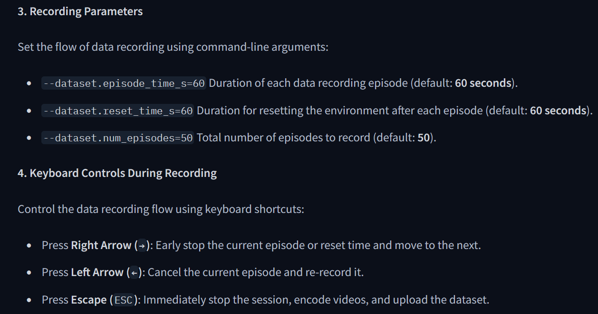

# LeBras
IA avec le robot SO-101

## Useful commands

- Teleopate :
```bash
lerobot-teleoperate --robot.type=so101_follower   --robot.port=<FOLLOWER_PORT>   --robot.id=follower-1 --teleop.id=leader-1 --teleop.type=so101_leader --teleop.port=<LEADER_PORT> --robot.calibration_dir="." --teleop.calibration_dir="."
```

- Create a dataset :
```bash
lerobot-record --robot.type=so101_follower --robot.port=<FOLLOWER_PORT> --robot.id=follower-1 --robot.calibration_dir=. --teleop.port=<LEADER_PORT>  --teleop.type=so101_leader --teleop.calibration_dir="." --teleop.id=leader-1  --dataset.repo_id="local/<FOLDER>" --dataset.num_episodes=<NUM_EPISODES> --dataset.push_to_hub=false --dataset.single_task="<TASK_NAME>"
```

- Train a model :
```bash
lerobot-train --dataset.repo_id="local/<FOLDER>" --policy.type=act  --output_dir=outputs/train/act_<TON_DATASET> --job_name=act_<TON_DATASET> --policy.device=cuda --policy.repo_id=${HF_USER}/act_<TON_DATASET>
```

- Example on Windows of teleopate:
```bash
lerobot-teleoperate --robot.type=so101_follower   --robot.port=COM6 --robot.id=follower-1 --teleop.id=leader-1 --teleop.type=so101_leader --teleop.port=COM5 --robot.cameras="{ front: {type: opencv, index_or_path: 1, width: 640, height: 480, fps: 30}}" --display_data=true
```

- Example on Windows for creating a dataset:
```bash
lerobot-record --robot.type=so101_follower --robot.port=COM6 --robot.id=follower-1 --robot.calibration_dir=. --teleop.port=COM5 --teleop.type=so101_leader --teleop.calibration_dir="." --teleop.id=leader-1  --dataset.repo_id="local/dataset" --dataset.num_episodes=10 --dataset.push_to_hub=false --dataset.single_task="Sort cubes" --display_data=true --robot.cameras="{ front: {type: opencv, index_or_path: 1, width: 640, height: 480, fps: 30}}
```
## Record controls


### Change default position for the robot

```bash
  --robot.default_positions List
                        Default joint positions (default: [0.0, 0.0, 0.0, 0.0, 0.0, 0.0, 0.0, 0.0, 0.0, 0.0, 0.0, 0.0,
                        0.0, 0.0, 0.0, 0.0, 0.0, 0.0, 0.0, 0.0, 0.0, 0.0, 0.0, 0.0, 0.0, 0.0, 0.0, 0.0, 0.0])
```